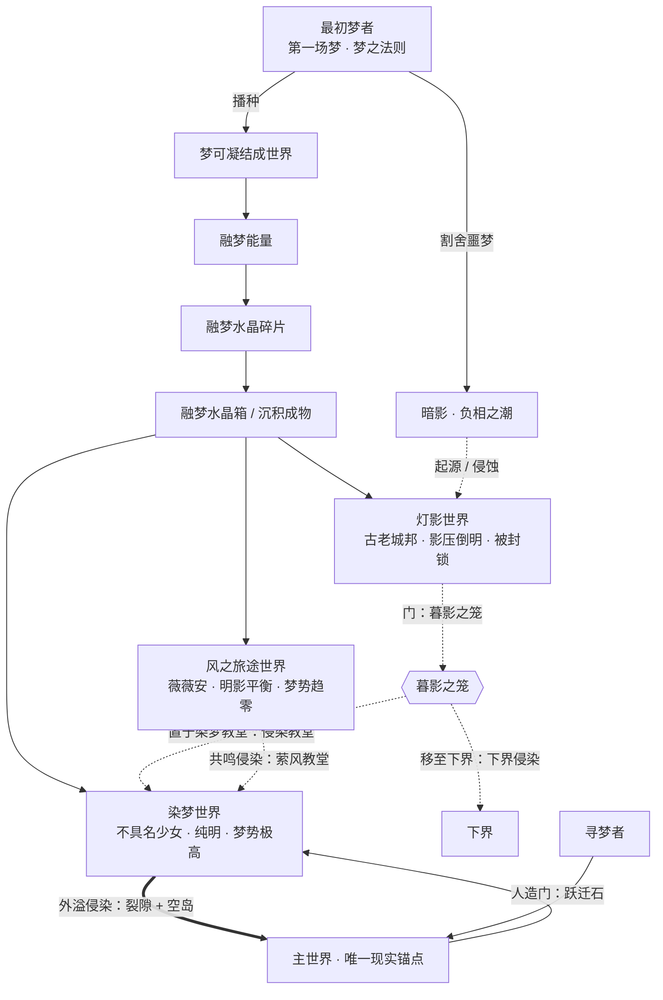

# PasterDream: Reborn 世界观设定总纲

> 状态：**v0.1 初稿（2026-09-14）**
> 定位：本模组的「设定圣经」。统一三界（染梦 / 灯影 / 风旅）的底层逻辑，约束后续剧情、书籍、术语、进度与物品文案。
>
> **已拍板决策（2026-09-14）**
> 1. 本源 ＝ **最初梦者 / 造物主说**
> 2. 三界关系 ＝ **众灵之梦，各自独立**
> 3. 主世界 ＝ **唯一原生现实锚点**
> 4. 融梦水晶碎片 ＝ **灵魂之梦的凝结碎片**
> 5. 灯影 ＝ 采「**梦生世界 ＋ 明暗二相**」方案，**原剧情一字不改**
> 6. 梦源层级 ＝ **梦者播种，众灵结果**
> 7. 染梦梦源 ＝ **不具名的最初少女**
>
> 阅读约定：本文中「**设定真值**」指作者层面的事实，游戏内角色**未必**知道；角色笔记里只能出现局部的、甚至互相矛盾的推测。

---

## 〇、一句话世界观

最初梦者做了第一场梦，确立了「梦可凝结成世界」的法则；此后每一个灵魂的执梦，都可能沉淀、凝结，长成一座座独立而**真实**的**梦生世界**。梦有明暗两相：明者凝为**融梦能量**与**融梦水晶碎片**，暗者沉为**暗影**。主世界是唯一的现实锚点，寻梦者穿过裂隙，走进这些诞生于梦、却真实存在的异世界。

---

## 一、第一性：梦之法则

### 1.1 最初梦者（Primordial Dreamer）

**设定真值**：在有「世界」之前，存在过第一个拥有「梦」的存在——史称**最初梦者**。它在虚无中做了第一场梦，并在那一刻确立了整套宇宙的根本法则：

> **梦不会消失，只会转化。足够强烈的梦，能够沉淀、凝结，最终成物、成界。**

最初梦者做完这场梦之后便隐没不现。它没有留下名号，只留下这条法则，以及梦的第一缕物质——**梦质**。后世一切关于「创造梦境之人」「最初的寻梦少女」「神明之力」的传说，都是对它的朦胧回响。

### 1.2 梦者播种，众灵结果

法则确立后，梦不再是某一位存在的特权：

- 一切**有灵之物**都会做梦，梦里逸散出梦质；
- 梦质在「梦境层」中汇聚、沉淀，化为**融梦能量**；
- 当某个灵魂的梦足够**庞大、执著、缱绻不散**时，它就会凝结成一个完整的**梦生世界**。

因此：**最初梦者播种法则与第一场梦，众灵各结自己的果**。三界彼此独立、互不统属，是同一条法则下开出的三朵不同的梦之花。

### 1.3 梦生世界是真实的

**梦生世界一旦凝成，即为真实存在。**其中有真实的大地、真实的生灵、真实的历史与悲剧。它们「诞生于梦」，但**不是「正在被谁梦着」**——不会因为梦主醒来而消失，也不会因为梦主死去而崩塌。

这一条是灯影原剧情得以完整保留的地基：古老城邦是真的，居民是真的，亚伦柯斯的悲剧是真的。

### 1.4 主世界：唯一原生现实锚点

- **主世界（Overworld）**是唯一的**原生现实**：不诞生于任何梦，是所有梦生世界得以被「穿过」「映照」「侵染」的锚点。
- 梦生世界是「带有梦境性质的异世界」——其本质与下界、末地同类，只是额外具备「梦」的性质，所以能通过**睡眠**抵达（绫苒理论，现升为设定真值）。
- 主世界**可以被梦生世界渗透**（裂隙、门、侵染），但它本身不是梦。

---

## 二、梦质的形态链（物质体系）

同一个「梦质」在不同浓度、不同状态下呈现为不同形态。这是全模组物品/方块的世界观统一解释：

```
最初梦者的第一场梦
        │ 逸散
        ▼
      梦质  ── 梦的原始物质
        │ 汇聚、流动
        ▼
  融梦能量  ── 梦生世界的大气与流体（涌泉、染梦液体、蓄梦池）
        │ 凝结
        ▼
 融梦水晶碎片 ── 梦的晶体；单枚碎片
        │ 富集
        ▼
  融梦水晶箱  ── 小范围大量聚集的晶体簇（开启＝能量逸散）
        │ 沉积
        ▼
 大陆 / 空岛 / 树木 / 建筑 ── 梦质沉积成的实体
        │ 巨型执梦
        ▼
   梦生世界  ── 一场执梦的完整凝结（染梦 / 风旅 / 灯影）
```

**守恒律**：梦不会凭空产生，也不会凭空消失。被**记住、珍惜、承接**的梦凝为**明相**；被**遗忘、遗弃、无人承接**的梦沉为**暗相（暗影）**。融梦水晶碎片，本质就是「一段没被完全消散、也没被记住的梦」。

---

## 三、明暗二相

| | 明相 · 梦 | 暗相 · 影 |
|---|---|---|
| 来源 | 被记住、被珍惜、被承接的梦 | 被遗忘、被遗弃、被否认、梦主消亡后无人承接的梦 |
| 形态 | 融梦能量、融梦水晶碎片、涌泉、世界树 | 沉淀阴影、暗影之息、影生物 |
| 倾向 | 凝结、生长、创造 | 侵蚀、同化、蛊惑 |
| 代表物 | 光明飞蝶（纯梦残片）、白厄水晶、染梦世界树 | 暮影之笼、暗影地牢、鬼魂之面、凝影剑柄 |

**暗影的源头（设定真值）**：最初梦者在梦出「美好世界」的同时，也梦出了与之相对的东西；它把不愿直面的那一部分**割舍**了。那被遗弃的梦，成为宇宙中**第一缕暗影**。此后所有被遗忘之梦都归入暗影，暗影因而无定形、无实体——**它以侵蚀与同化为唯一的存在方式**，天生渴望借「门」扩散到更多梦生世界。

> 这让灯影的「**暗影降临**」字面成立：暗影本是游离于梦境层之间的负相之潮，**自外界侵入**了那座梦生城邦。原剧情的每一个事件、每一句台词都无需改动。

---

## 四、三界总表

| 维度 | 梦源 | 明暗比 | 梦势 / 侵染性 | 梦之轴心 | 入口 | 核心意象 |
|---|---|---|---|---|---|---|
| **染梦世界** Dyedream World | 一位**不具名的最初少女**的绮丽幻想 | 纯明 | **极高 · 外溢侵染**（唯一主动侵染主世界者） | **染梦世界树** | 染梦裂隙 / 跃迁石 / 入眠 | 飞花、粉红、教堂、浮空岛、逐梦列车 |
| **风之旅途世界** Wind Journey World | **薇薇安**（绝症少女）对飞翔与自由的祈愿 | 明影平衡 · 自由 | **趋零 · 共鸣侵染**（仅被动渗透） | 破风骑士祭坛 / 风之本身 | 染梦教堂 + 奇异炖菜 + 入眠 | 云海浮岛、热气球、风铃笼、永恒寒冬 |
| **灯影世界** Lamp Shadow World | 古老城邦（梦生文明，梦源已湮没） | **影压倒明** | **高 · 侵蚀侵染**（被封锁，仅经门渗漏） | 暮影之笼（灯） | 暮影之笼 + 暮影长床入眠 | 沉淀阴影、暗影地牢、漆黑枯骨、真菌森林 |

三界没有高下主次，是「同一个父亲（最初梦者）的法则」下，「不同孩子（众灵）」各自做成的梦。**三界只有染梦会主动向外侵染**——因为它也是三界中唯一「梦源不醒、梦仍在生成」的世界。

---

## 五、染梦世界 —— 起源之梦

### 5.1 梦源

**一位不具名的最初少女**。她在某个不为人知的时刻，做了一场最绮丽、最完整、最漫长的梦。这场梦没有随她醒来而消散，反而凝结成了**染梦世界**。

- 游戏内只留下她的影：**「最初的寻梦少女沉眠于长虹」**、极稀有的**琴雨梦玩偶**（参照她的形象）、以及**琴雨梦套装**。
- **琴雨梦 ≠ 该少女**。琴雨梦是「第一位**进入**染梦的寻梦者」，是最初少女在人间的映照 / 继承者，而非梦源本身。二者形象相近、易被混淆，是刻意的叙事设计。

> 这与「最初的那位创造梦境之人」「一真一假两种世界树」等传说互为注脚：**真世界树**＝染梦的梦之轴心；**假世界树**＝暗影试图寄生出的赝品 / 已消亡的旧轴心（传说，待剧情揭晓）。

### 5.2 特征

- 明相最盛，**融梦能量最富集**，故有世界树、涌泉、大量水晶箱；
- 永昼般的粉白天空，环境本身能安抚精神（但在场者会察觉「无处的疏离感」，即梦生世界的破绽）；
- 结构繁多：染梦教堂、浮空神庙、染梦实验室、染梦小客栈、染梦穿云塔、染梦空岛、逐梦列车、气泡生态球、浮空岛群。

### 5.3 关键结构释义

| 结构 | 世界观解释 |
|---|---|
| 染梦世界树 | 染梦的**梦之轴心**，融梦能量最富集处；世界树种荚蕴含极高浓度梦质 |
| 染梦教堂 | 未知信仰的造物（也可能出自筑梦者）；内有融梦水晶箱与前辈笔记 |
| 染梦实验室 | 前辈寻梦者研究梦质的据点；核心仪器即融梦釜原型 |
| 融梦涌泉井 | 融梦能量以流体形态涌出地表的「源头活水」 |
| 逐梦列车 | 梦生世界自发运行的造物，车载水晶箱与生命水晶 |

---

## 六、风之旅途世界 —— 祈愿之梦

### 6.1 梦源

**薇薇安**——一位罹患白血病、长期住院的少女。同学们送她一只祈福的风铃；每个夜里，她都会梦见一个苍青色、云朵与气球漂浮的世界，梦见自己自由自在地飞翔。

这场**病榻上的祈愿**凝结成了**风之旅途世界**。

- 世界中的**风铃笼**，正是「同学们送她的风铃」被放大成的巨构；
- 世界**无太阳、无月亮**，天光恒定，风每日清晨变向——因为这是一个「没有时间刻度、只属于祈愿」的梦；
- 破风骑士祭坛中「仍执行守护使命的骑士」，是她幻想里守护她的存在。

### 6.2 特征

- 明影较为**平衡**，是三者中最「自由」的世界：风既是阻力，也是恩赐与钥匙；
- 末地式浮空岛地形（复用末地噪声），云层可立足；
- 结构：热气球群、小气球群、风磨小屋、风泊树、圣诞树岛、破风幕帐、风铃笼。

### 6.3 入口与承接

经由**染梦教堂**：吃下奇异炖菜、于教堂入眠，教堂已被侵染为翠绿——醒来时便身处风旅。这条入口本身暗示：三界之间**可以互相侵染、互相连通**（详见第九章）。

---

## 七、灯影世界 —— 被暗影吞噬的梦

> 本章**严格保留原剧情**（见 `灯影之下.txt`），仅补充其世界观归因。

### 7.1 梦源

**古老城邦**——一座诞生于某场梦的文明。其梦源（最初的梦主）已湮没于史，如今只余传说。城邦曾是完整的梦生世界，拥有自己的秩序与荣光。

### 7.2 暗影为何能降临

暗影是游离于梦境层之间的**负相之潮**（第三章）。它找到了这座梦生城邦，并在某个节点**侵入**：

> **古老城邦时代** → **暗影降临，异变开始** → **黑暗纪元** → **黑弥撒日** → **暗影地牢**

暗影的入侵之所以成功，是因为它精准地利用了「梦」的软肋——**执念与愿望**。它向危难中的守护者许诺救国之策，从而在梦的内部生根。

### 7.3 原剧情（完整保留）

- **亚伦柯斯**：古代城邦的守护者 / 王。国难当头，被暗影蛊惑，签下协议以求救国；随后被暗影侵蚀，整个维度陷入黑暗。在丧失理智前的最后一刻，他将**整个维度封存**。
- **无名**：亚伦柯斯的朋友 / 战友，被波及后以残留意志对抗暗影。卡莱在暗影中寻见他，他在封印中出力；但在「消灭亚伦柯斯」还是「等他醒来」上与卡莱激烈争吵。**光明飞蝶**是他不被暗影侵蚀的依仗。
- **卡莱**：伊诺的主人。与伊诺进入被封存的灯影，为救被侵蚀的伊诺，与暗影交易（「给我你的力量，作为条件，我可以给你做任何事，但不是作为你的奴隶」「允」「但你是门」），镇压亚伦柯斯、救回伊诺，用最后一根骨针把伊诺送出。此后借光明飞蝶掌握暗影之力，得以离开，留下**暮影之笼**与自己的**影子**。
- **伊诺**：卡莱的仆人，随主进入封存世界，被亚伦柯斯波及侵蚀，后经交易痊愈并送离。
- **千夜 / 极星**：进入灯影探索，最终不敌亚伦柯斯而撤离。

### 7.4 关键物件的世界观归因

| 物件 | 归因 |
|---|---|
| **暮影之笼** | 灯影与其他维度连通的「**门**」，也是防暗影外溢的「**锁**」；被卡莱藏于下界基岩上方，以锁链悬吊、染梦长床镇压、切割整个建筑独立于世界之外。暗影渴望借它扩散 |
| **光明飞蝶** | **明相·纯梦残片**——暗影唯一无法侵染之物。明相天然克制暗相，故为「已知对抗暗影的唯一物品」 |
| **黄金预言** | 卡莱祖父遗物；接触融梦能量（明相）后获得趋利避害之力，在灯影又被沾染暗相，故兼具两种力量 |
| **鬼魂之面** | 被暗影侵蚀的旧居民，即「无人承接之梦」的残影；卡莱将其编织为面纱 |
| **暗影之息** | 被捕的「低语」——暗影意志的碎语，隔绝其影响并转予力量 |
| **暗影地牢** | 封印亚伦柯斯的结构；他本人成为暗影在该世界的锚点 |

### 7.5 灯影在模型中不违和的原因

- 「暗影**降临**」＝外来负相之潮入侵，字面成立；
- 「城邦与居民是真的」＝梦生世界是真实的，悲剧不被架空；
- 「光明飞蝶唯一克制暗影」＝明克暗的物理法则；
- 「卡莱是门」＝暗影需要「门」扩散，与暮影之笼呼应；
- 亚伦柯斯「封存维度」＝切断暗影与其他梦生世界的通路，是悲壮的自我献祭，而非「梦醒了」。

---

## 八、暗影学

### 8.1 暗影的三重性质

1. **遗弃之梦**：暗影的本体是所有被遗忘、被遗弃之梦的沉淀（游戏内直译为「**沉淀阴影**」）；
2. **负相之潮**：它无定形、无独立世界，只能游离于梦境层之间；
3. **侵蚀意志**：它以侵蚀、同化、蛊惑为存在方式，渴望扩散，因此总在寻找「门」。

### 8.2 暗影与心智

暗影与「精神」高度相关，这为 SAN / 暗影难度系统提供了设定支撑：

- **低理智者更容易被暗影盯上**：暗影借心智的裂缝窥视（**暗影窥视**）、沉默（**暗影沉默**）、诱发疯狂（**疯狂 I/II/III**）；
- 寻梦者从灯影濒临疯狂地逃回主世界后，主世界竟也出现暗影怪物——因为**暗影黏在了他的心智上**，而非只在灯影存在；
- **苍白骨针**能以剧烈疼痛与清醒，把意识从梦生世界强行锚回主世界身体（其原理疑与苍白雪莲所含梦境力量有关，待揭晓）。

### 8.3 对抗暗影的路径

- **明相之力**：光明飞蝶、白厄水晶、融梦能量；
- **清醒**：苍白骨针、保持精神稳定（SAN）；
- **理解与接纳**：终局战斗的分歧——化身为灯消灭它 / 融入阴影接纳它（对应亚伦柯斯线的双结局倾向）。

---

## 九、主世界与寻梦

### 9.1 寻梦者（Dream Seekers）

**寻梦者**＝从主世界穿过通道，进入梦生世界的人。玩家与历代前辈（琴雨梦、夜岚、千夜、极星、青岚、彗星、流华、绫苒等）皆属此列。

- **身体与精神一同穿越**（非普通梦境只有精神抵达）；
- 梦生世界中的战利品可带回主世界；在梦中的伤势、濒死也会反映到主世界身体上；
- 前辈们留下的**寻梦者笔记**，一部分是亲笔，一部分是**梦生世界将其所见自动具现成文**（故有些笔记会在原地「再生」）。

### 9.2 通道一览

| 通道 | 连接 | 性质 |
|---|---|---|
| 染梦裂隙 | 主世界 ↔ 染梦 | 自然侵染裂隙（偶发） |
| 染梦世界跃迁石 | 主世界 ↔ 染梦 | 绫苒以水晶块+染梦粉尘人造，伴随**侵染**副作用 |
| 暮影之笼 + 暮影长床 | 主世界/其他维度 ↔ 灯影 | 卡莱封存的门/锁 |
| 染梦教堂 + 奇异炖菜 + 入眠 | 染梦 ↔ 风旅 | 天然**共鸣点**；入眠后抵达风旅，教堂被侵染为**萦风教堂** |
| 睡眠 / 入眠 | 主世界 ↔ 各梦生世界 | 因梦生世界具「梦」的性质 |

### 9.3 侵染机制（核心）

**有通道，就有联系；有联系，就有侵染。**这是绫苒的结论，也是本世界观**最核心的跨世界机制**。它一次性解释了裂隙、空岛、侵染教堂、萦风教堂、暮影之笼与下界黑暗的全部成因。

#### 9.3.1 侵染的第一性：梦势差

**侵染 ＝ 一个梦生世界的「梦势」，沿通道向另一世界外溢、同化其环境的现象。**

- **梦势**：一个世界的梦质压力，等于其**明相与暗相的失衡程度**。
  - 明相过剩 → 高梦势，向外「生长、创造」；
  - 暗相过剩 → 高梦势，向外「腐蚀、同化」；
  - **明暗平衡 → 梦势趋零，边界稳定，不主动外溢。**
- **驱动**：侵染只在存在**梦势差**的方向上自发发生；梦势差越大，越容易撕裂边界。
- **封锁**：高梦势世界若被从外部**封存**（亚伦柯斯的维度封存 ＋ 卡莱的锁），其外溢被压制，**不再自发**，但仍可经已有的「门」持续渗漏。

#### 9.3.2 侵染的三要素

| 要素 | 说明 |
|---|---|
| **梦势差（驱动）** | 明暗失衡造成的能量梯度；平衡世界无此驱动 |
| **通道（载体）** | **裂隙**（自发撕裂）／**门**（人为或异变，如暮影之笼、跃迁石）／**共鸣点**（边界薄弱处，如染梦教堂） |
| **介质（作用面）** | 被侵染方的环境；越「无主、可塑」越易被同化 |

**关键法则**：**「门」可以无视梦势差与封锁，强行建立侵染通道**——这正是人造门与暮影之笼最危险之处。

#### 9.3.3 四类侵染

| 类型 | 驱动 | 通道 | 实例 |
|---|---|---|---|
| **外溢侵染** | 染梦（明相过剩，梦势极高） | 自发**裂隙** | 染梦 → 主世界：自然生成的**染梦裂隙**与**染梦空岛** |
| **侵蚀侵染** | 灯影（暗相过剩，但被封存） | **门**（暮影之笼） | 灯影 → 染梦教堂（**侵染教堂**）；灯影 → 下界（门移入之后） |
| **共鸣侵染** | 邻界牵引（被动、微量） | 天然**共鸣点** | 风旅 → 染梦教堂（**萦风教堂**） |
| **人造门侵染** | 强制建立 | **跃迁石 ／ 门** | 绫苒跃迁石 → 主世界局部染梦化；「暮影之笼若在主世界」假想 |

#### 9.3.4 三界侵染谱系

**染梦 —— 唯一的「主动侵染者」（外溢侵染）**

- 染梦是**唯一仍在外溢**的梦生世界：其梦源（最初少女）**沉眠不醒、梦未终止**，明相持续过剩，边界永不稳定。
- 梦质从最薄弱处撕开主世界边界，形成**染梦裂隙**；溢出的梦质在裂隙周边沉积、抬升，形成**染梦空岛**。
- 因此：**裂隙是伤口，空岛是溢出物**，二者同源。这并非「染梦无理由地在主世界开门」，而是「一个仍在做梦的世界」的必然现象。
- 主世界之所以首当其冲：它是唯一的**现实锚点**，梦势为零，与染梦之间**梦势差最大**。

**灯影 —— 被封锁的「侵蚀者」（侵蚀侵染）**

- 灯影暗相过剩，本应向外侵蚀；但被**亚伦柯斯的维度封存**与**卡莱的暮影之笼**双重封锁，无法自发外溢。
- 唯一的外泄口是**暮影之笼本身**——它是一扇「门」。**门在哪里，哪里就被灯影侵染：**
  - 门原在**染梦教堂** → 该教堂被暗影侵蚀 → **侵染教堂**（教堂一半「被什么侵入」、空中渗黑液）；
  - 卡莱将门移至**下界上层** → 下界被暗影侵染，至今仍在溢出（故「黑暗的来源」指向下界）。
- 这同时解释了**卡莱为何把门藏于下界**：下界荒芜、危险、且非主世界，是**牺牲最小**的隔离场所。**若门被藏进主世界，主世界早已被暗影侵蚀。**

**风旅 —— 稳定态（共鸣侵染）**

- 风旅明影**平衡**，梦势趋零，**既不自发裂隙，也不产生门**，因此**天然不会侵染主世界**。
- 它与外界唯一的接触，是寻梦者在**染梦教堂**举行入眠仪式（奇异炖菜）时留下的**共鸣点**：风旅的梦质顺此微量回流，把该教堂侵染为翠绿 → **萦风教堂**。
- 这是一种**被动、局部、单向**的侵染，程度远低于染梦／灯影，因此只污染了一处教堂，未波及主世界。**这不是漏洞，而是「稳定之梦」的定义特征。**

#### 9.3.5 两个「疑似漏洞」的修补结论

1. **风旅无门、又不侵染主世界** → 不是漏洞：明暗平衡的世界梦势为零，本就**没有自发侵染的能力**；它只能被通道「带着」被动渗透。
2. **染梦「无理由」地在主世界生成传送门** → 不是漏洞：染梦并不「生成门」，而是**明相过剩导致边界自发破裂**；裂隙与空岛是同一外溢现象的**通道面**与**沉积面**。其特殊性源于「**梦源仍未醒、梦仍在生成**」——这是三界中独一份的状态。

---

## 十、阵营与组织

| 阵营 | 说明 |
|---|---|
| **寻梦者** | 主世界来客的统称；松散、无统一组织，以笔记相互接续 |
| **筑梦者** | 先于寻梦者、能主动塑造梦境结构的存在；世界树、空岛、教堂之类奇观或出自其手。游戏内为传说级称谓（其源头通向「最初梦者」；开发者彩蛋即以「筑梦者」自居） |
| **染梦教团 / 教堂** | 信仰不明的组织，留下大量教堂与仪式结构；「他们信奉何种宗教」是待解之谜 |
| **暗影阵营** | 暗影意志（低语）、被侵蚀的亚伦柯斯、卡莱的影子、鬼魂、各影生物 |
| **古老城邦遗民** | 灯影中沦为鬼魂的旧居民 |

---

## 十一、角色谱系

### 11.1 梦源 / 传说层

| 角色 | 定位 |
|---|---|
| **最初梦者** | 第一场梦的作者，梦之法则的播种者 |
| **最初少女** | 染梦的梦源；「最初的寻梦少女沉眠于长虹」 |
| **薇薇安** | 风旅的梦源；病榻祈愿的少女 |
| **筑梦者** | 梦境奇观的营造者（传说层） |

### 11.2 寻梦者（主世界来客）

| 角色 | 事迹 |
|---|---|
| **琴雨梦（QYM）** | 第一位进入染梦的寻梦者；与夜岚同行；「最初的寻梦少女」在人间的映照 |
| **夜岚** | 琴雨梦的同伴，多次共同探索染梦 / 灯影 |
| **千夜** | 早期探索灯影，与亚伦柯斯交战败退；苍白骨针、暗影记录 |
| **极星** | 研究者；灯影地形、阴影生物、世界树理论、锻造工坊记录 |
| **青岚** | 炼金 / 融梦炼金术研究者（融梦釜、灵药瓶） |
| **彗星** | 发现并接续染梦实验室残破仪器 |
| **流华** | 早期记录者（「来往于梦」） |
| **绫苒** | 寻梦的魔法使；发现三界本质与侵染理论、研发跃迁石 |

### 11.3 灯影角色

| 角色 | 定位 |
|---|---|
| **亚伦柯斯** | 古老城邦守护者 / BOSS；救国心切被暗影蛊惑，堕落并封存维度 |
| **无名** | 亚伦柯斯挚友 / 战友；以残留意志对抗暗影，光明飞蝶持有者 |
| **卡莱** | 与暗影交易、封印亚伦柯斯、留下门与影子的悲剧旅行者 |
| **伊诺** | 卡莱的仆人；被侵蚀后获救送出 |

### 11.4 关联角色

- **塞西莉亚（Cecilia）**：赐福相关（Blessing of Cecilia）；
- **阿基萨·绫音（Akizuki Ayane）**：灵魂石相关角色，或与绫苒体系相关（待厘清身份关系）。

---

## 十二、纪元时间线

| 纪元 | 事件 |
|---|---|
| **第一梦** | 最初梦者做出第一场梦，确立梦之法则，随后隐没 |
| **众梦凝结期** | 梦质汇聚为融梦能量；众灵之梦陆续凝结成梦生世界，其中染梦（不具名少女）、风旅（薇薇安）等相继诞生 |
| **古老城邦时代** | 灯影的梦生文明繁荣，一切正常 |
| **黑暗纪元** | 暗影降临灯影；亚伦柯斯被侵蚀，城邦崩坏，维度被封存 |
| **黑弥撒日** | 卡莱与伊诺进入封存灯影；伊诺被侵蚀；卡莱与暗影交易、封印亚伦柯斯、送出伊诺、留下暮影之笼与影子 |
| **寻梦纪元** | 琴雨梦穿过染梦裂隙，成为第一位寻梦者；历代寻梦者留下笔记、理论（绫苒的三界本质与侵染论）、造物（跃迁石、融梦釜）；灯影探险者时代 |
| **当下** | 玩家作为新的寻梦者踏入三界 |

> 时间线相对顺序为**设定真值**；各梦生世界内部的时间流速彼此独立，甚至与主世界不同（灯影中「外面 3 天」的体感差），这一点保留为世界的未解之谜。

---

## 十三、术语表（世界观向）

| 术语 | 定义 |
|---|---|
| 最初梦者 / 造梦者 | 第一场梦的作者，梦之法则的源头 |
| 梦生世界 / 梦境维度 | 由某场执梦凝结而成的、真实存在的独立异世界 |
| 梦源 / 梦主 | 凝结出某个梦生世界的那场梦的主人 |
| 梦质 | 梦逸散出的原始物质，融梦能量的前体 |
| 融梦能量 | 梦质汇聚流动的形态，梦生世界的大气与流体 |
| **融梦水晶碎片** | 灵魂之梦的凝结碎片，本模组的核心物质 |
| 明相 | 被记住 / 珍惜 / 承接之梦，凝为创造之力 |
| 暗相 / 暗影 | 被遗忘 / 遗弃 / 无人承接之梦，沉为侵蚀之力 |
| 沉淀阴影 | 暗影在灯影地表的沉积形态 |
| 门 | 连接梦生世界与现实/其他世界的通道；**可无视梦势差与封锁强行建立侵染**；暗影扩散的必要条件 |
| 侵染 | 梦势沿通道外溢、同化另一世界环境的现象 |
| 梦势 | 世界的梦质压力＝明暗失衡程度；失衡越大越易外溢，平衡则趋零 |
| 外溢侵染 | 明相过剩世界自发撕裂边界（染梦 → 主世界的裂隙与空岛） |
| 侵蚀侵染 | 暗相过剩世界经门渗漏侵蚀（灯影 → 染梦教堂 / 下界） |
| 共鸣侵染 | 邻界经天然薄弱点的被动微量渗透（风旅 → 染梦教堂的萦风教堂） |
| 寻梦者 | 从主世界进入梦生世界的人 |
| 筑梦者 | 传说中主动营造梦境奇观的存在 |
| 长虹 | 染梦最初少女沉眠之地（意象，具体不详） |

---

## 十四、核心物品的世界观锚点

> 供物品文案与 Tooltip 统一口径。

| 物品 / 方块 | 世界观锚点 |
|---|---|
| **融梦水晶碎片** | 灵魂之梦的凝结碎片。可储能、强化工具（融梦工具）、放置成水晶簇、点燃暮影之笼、作为星币载体 |
| 融梦水晶箱 | 小范围富集的晶体簇，开启时融梦能量逸散（故「震动次数越多宝藏越好」） |
| 融梦涌泉 / 染梦液体 | 融梦能量的流体形态，「源头活水」 |
| 融梦世界树 | 染梦的梦之轴心，融梦能量最富集处 |
| 苍白骨针 | 以剧烈疼痛/清醒把意识锚回主世界；与苍白雪莲、末地珍珠、古城回响相关 |
| 生命水晶 | 梦质凝结的「生命力」结晶，可一次性提升生命上限 |
| 白厄水晶 | 明相结晶；可改造夜明蝶为光明飞蝶 |
| 光明飞蝶 | 明相·纯梦残片，暗影唯一无法侵染之物 |
| 凝影剑柄 | 以暗影凝练的武器部件（明暗二相的暗相利用） |
| 暮影之笼 | 灯影的门与锁 |
| 黄金预言 | 兼具明相（趋利避害）与暗相（交易后获得）的占卜牌 |
| 梦笔记 / 寻梦者笔记 | 前辈亲笔，或梦生世界自动具现的所见 |

---

## 十五、与现有内容的映射与落地建议

### 15.1 无需改动，直接纳入

- **灯影全部内容**（`灯影之下.txt`、卡莱/亚伦柯斯/无名/伊诺笔记、暮影之笼、暗影图书馆、交易/欺诈/破碎）：与「梦生世界 + 明暗二相」完全兼容，**一字不改**。
- **染梦全部游记、风旅全部笔记**：本就是「梦源之梦」的直接叙事，直接纳入。
- **SAN / 暗影难度系统**：由第八章「暗影与心智」提供设定支撑。

### 15.2 已自洽、可直接引用的「真值」句

- 绫苒《梦境世界的本质》中对三界＝「带有梦境性质的异世界」的结论 → **升为设定真值**（第一章 1.4）。
- 极星《染梦世界树》中「融梦能量分布不均匀、沉积成实体」→ **升为物质体系**（第二章）。
- 青岚《融梦釜与融梦炼金术》→ 归入梦质利用技术。

### 15.3 需要后续注意的表述

- **琴雨梦 ≠ 染梦梦源**：现有文本中「最初的寻梦少女」「最早/最初的寻梦者」多处指向琴雨梦，需在后续文案中**区分**「最初少女（梦源）」与「琴雨梦（第一位寻梦者）」，或刻意保留模糊作为叙事张力（推荐后者，并在指南书中留一句可指认的提示）。
- **「筑梦者」**：目前仅见于开发彩蛋。建议正式定为传说层称谓（第十章），与「最初梦者」拉开层级。
- **风旅梦源薇薇安**：现有《风铃笼》笔记已给出足够线索，建议在风旅维度正式入口/指南书补一段呼应，使「薇薇安＝风旅梦源」可被玩家推知。

### 15.4 后续可增补的内容

- 由「寻梦者笔记」串联的**主线进度**：染梦裂隙 → 染梦探索 → 世界树 → 灯影（暮影之笼）→ 亚伦柯斯决战 → 风旅。
- 「**真/假世界树**」传说线；
- 「**筑梦者**」与「**最初梦者**」关系的正式揭晓节点。

---

## 十六、待定与留白清单

以下为**刻意保留或尚待决定**的项，禁止在未拍板前写死：

1. 灯影**梦源的具体身份**（疑似亚伦柯斯本人 / 城邦集体 / 已湮没的某人）；
2. 暗影意志是否具有**统一人格**，还是纯粹法则性的负相；
3. 「**假世界树**」的确切来历与结局；
4. **筑梦者**与最初梦者的关系（同一 / 后继 / 独立）；
5. **阿基萨·绫音**与绫苒的身份关系；
6. 各梦生世界**内部时间流速**差异的成因；
7. 主世界是否**终将被侵染摧毁**（结局走向）；
8. 亚伦柯斯的最终归宿（消灭 / 唤醒）——目前两种倾向并存，留作选线。

---

## 附录 A：宇宙结构示意图



---

*本文为 v0.1 初稿，随内容实现持续迭代。任何与本文冲突的旧文案，以本文为准或经决策后回改本文。*
